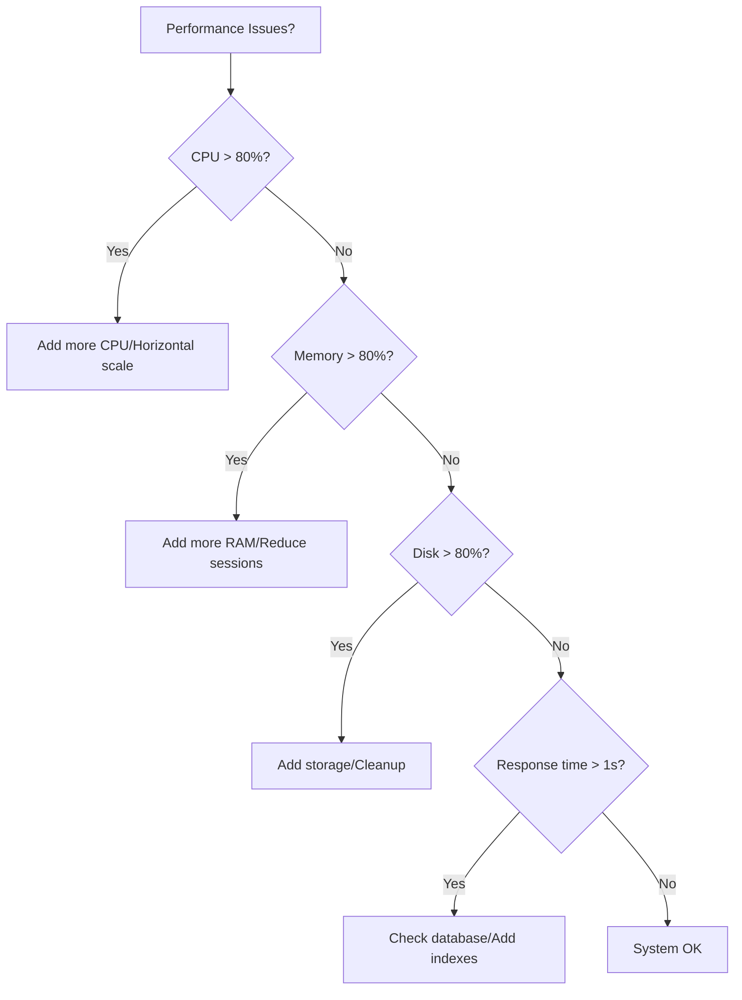

# 11 - Operational Runbooks

## 11.1 Overview

This document contains Standard Operating Procedures (SOP) for OpenWA operations, including incident response, maintenance procedures, and troubleshooting guides.

### Runbook Structure

Each runbook follows this format:

```
## Runbook: [Title]
### Trigger
### Impact
### Prerequisites
### Steps
### Verification
### Rollback
```

## 11.2 Incident Response

### Runbook: Service Down

**Trigger:** Health check failing, API not responding

**Impact:** All sessions affected, messages not processing

**Prerequisites:**

- SSH access to server
- Docker CLI access
- Database access

**Steps:**

```bash
# 1. Check container status
docker compose ps

# 2. Check container logs. Every `docker compose … openwa-api` below names the service as the
#    production docker-compose.yml defines it — on docker-compose.dev.yml that service is called
#    `openwa`, so substitute it there. The bare `docker stats`/`docker restart` forms take the
#    container name, which is `openwa-api` under both files.
docker compose logs --tail=100 openwa-api

# 3. Check system resources
docker stats --no-stream
df -h
free -m

# 4. Identify root cause
# A. Container crashed
docker compose logs openwa-api 2>&1 | grep -i "error\|fatal\|crash"

# B. Out of memory
docker compose logs openwa-api 2>&1 | grep -i "oom\|memory"

# C. Database connection
docker compose logs openwa-api 2>&1 | grep -i "database\|connection refused"

# 5. Apply fix based on cause:

# A. Simple restart
docker compose restart openwa-api

# B. Full restart with cleanup
docker compose down
docker compose up -d

# C. Memory issues - increase limit
# Edit docker-compose.yml and increase memory limit
docker compose up -d

# D. Database issues (built-in PostgreSQL runs as container `openwa-postgres`, both when
#    started via the compose `postgres`/`full` profile and when orchestrated by the app)
docker restart openwa-postgres
# Wait for postgres to be ready
sleep 10
docker compose restart openwa-api
```

**Verification:**

```bash
# Check health
curl http://localhost:2785/api/health

# Check all sessions reconnected (id alongside status — the send below needs the id)
curl -H "X-API-Key: $API_KEY" \
  http://localhost:2785/api/sessions | jq '.[] | {id, name, status}'

# Send test message ({sessionId} is the UUID from the listing above — session routes
# resolve by id, not by session name)
curl -X POST http://localhost:2785/api/sessions/{sessionId}/messages/send-text \
  -H "X-API-Key: $API_KEY" \
  -H "Content-Type: application/json" \
  -d '{"chatId": "628xxx@c.us", "text": "Test after restart"}'
```

**Rollback:** Restore from backup if data corruption detected (see Runbook: Restore from Backup)

---

### Runbook: Session Disconnected

**Trigger:** Session status changed to DISCONNECTED, webhook not receiving messages

**Impact:** Single session affected

**Prerequisites:**

- API Key
- Physical access to phone (if QR needed)

**Steps:**

```bash
# 1. Check session status
curl -H "X-API-Key: $API_KEY" \
  http://localhost:2785/api/sessions/{sessionId}

# 2. Check if auto-reconnect is working
docker compose logs openwa-api 2>&1 | grep -i "{sessionId}" | tail -20

# 3. Try session restart (stop then start — there is no /restart route)
curl -X POST -H "X-API-Key: $API_KEY" \
  http://localhost:2785/api/sessions/{sessionId}/stop
curl -X POST -H "X-API-Key: $API_KEY" \
  http://localhost:2785/api/sessions/{sessionId}/start

# 4. Wait for reconnection (30 seconds)
sleep 30

# 5. Check status again
curl -H "X-API-Key: $API_KEY" \
  http://localhost:2785/api/sessions/{sessionId}

# 6. If still disconnected, check phone:
#    - Is phone connected to internet?
#    - Is WhatsApp Web still linked in phone settings?
#    - Has the phone been inactive for 14+ days?

# 7. If need to re-scan QR:
#    The endpoint returns a PNG data URL: { "qrCode": "data:image/png;base64,...", "status": "qr_ready" }
curl -H "X-API-Key: $API_KEY" \
  http://localhost:2785/api/sessions/{sessionId}/qr

# Display QR in terminal: there is no raw/format param — consume the `session.qr`
# webhook/WebSocket event to get the raw QR string for qrencode.
```

**Verification:**

```bash
# Session connected
curl -H "X-API-Key: $API_KEY" \
  http://localhost:2785/api/sessions/{sessionId} | jq '.status'
# Expected: "ready"

# Test message
curl -X POST http://localhost:2785/api/sessions/{sessionId}/messages/send-text \
  -H "X-API-Key: $API_KEY" \
  -H "Content-Type: application/json" \
  -d '{"chatId": "628xxx@c.us", "text": "Session reconnected"}'
```

---

### Runbook: High Memory Usage

**Trigger:** Memory usage > 80%, alerts from monitoring

**Impact:** Performance degradation, potential OOM

**Prerequisites:**

- SSH access
- Docker CLI

**Steps:**

```bash
# 1. Check current memory usage (the container is named `openwa-api`)
docker stats --no-stream openwa-api
free -m

# 2. Identify memory consumers
# Process-wide memory: scrape /api/metrics (Prometheus text, Bearer METRICS_TOKEN)
curl -H "Authorization: Bearer $METRICS_TOKEN" \
  http://localhost:2785/api/metrics \
  | grep -E "openwa_process_resident_memory_bytes|openwa_process_heap_used_bytes"

# 3. Check for memory leaks
docker compose logs openwa-api 2>&1 | grep -i "heap\|memory\|gc"

# 4. Immediate actions:

# A. Clear the in-process cache (no runtime cache-clear API — restart the container;
#    if using Redis, flush via redis-cli)
docker compose restart openwa-api

# B. Restart container (will reconnect sessions)
docker compose restart openwa-api

# C. If caused by too many sessions:
# List sessions (no sort param); process memory is in stats/overview (memoryUsage, MB)
curl -H "X-API-Key: $API_KEY" \
  http://localhost:2785/api/sessions/stats/overview

# Consider removing unused sessions

# 5. Long-term fix:
# Edit docker-compose.yml
# Increase memory limit or reduce max sessions
```

**Verification:**

```bash
# Memory below threshold
docker stats --no-stream openwa-api
# Expected: Memory usage < 80%

# All sessions still connected
curl -H "X-API-Key: $API_KEY" \
  http://localhost:2785/api/sessions | jq '.[].status'
```

---

### Runbook: Webhook Delivery Failure

**Trigger:** Webhook success rate < 95%, alert from monitoring

For sustained/high-volume webhook traffic, enable Redis-backed dispatch with `QUEUE_ENABLED=true`.
The inline fallback deliberately has bounded concurrency and a bounded waiter queue; overflow is recorded
as a delivery failure rather than retaining payloads without limit.

**Impact:** External systems not receiving events

**Prerequisites:**

- API Key
- Access to webhook endpoint

**Steps:**

```bash
# 1. Check webhook status
curl -H "X-API-Key: $API_KEY" \
  http://localhost:2785/api/sessions/{sessionId}/webhooks

# 2. Check recent webhook deliveries — this admin-only endpoint lists abandoned deliveries
#    most-recent-first: those that exhausted every retry, plus those never attempted at all
#    (recorded with `attempts: 0` — payload over the cap or an unserializable payload
#    (preflight), inline waiter-queue overflow, or rejection by the shutdown drain).
#    A URL blocked by the SSRF guard never reaches delivery: it is rejected with a 400 when the
#    webhook is registered, so it appears in no delivery-failure row.
curl -H "X-API-Key: $API_KEY" \
  "http://localhost:2785/api/webhooks/delivery-failures?sessionId={sessionId}&limit=20"

# Attempts still in flight (not yet exhausted) only appear in the server logs:
docker compose logs openwa-api 2>&1 | grep -i "webhook" | tail -20

# 3. Identify failure reason:
# A. Endpoint not responding
curl -v https://your-webhook-endpoint.com/openwa

# B. SSL certificate issues
curl -v --insecure https://your-webhook-endpoint.com/openwa

# C. Timeout
curl -v --max-time 30 https://your-webhook-endpoint.com/openwa

# D. Authentication failed
curl -v -H "Authorization: Bearer token" \
  https://your-webhook-endpoint.com/openwa

# 4. Test webhook delivery
curl -X POST -H "X-API-Key: $API_KEY" \
  http://localhost:2785/api/sessions/{sessionId}/webhooks/{webhookId}/test

# 5. Fix based on cause:

# A. Update webhook URL
curl -X PUT http://localhost:2785/api/sessions/{sessionId}/webhooks/{webhookId} \
  -H "X-API-Key: $API_KEY" \
  -H "Content-Type: application/json" \
  -d '{"url": "https://new-endpoint.com/webhook"}'

# B. Update authentication
curl -X PUT http://localhost:2785/api/sessions/{sessionId}/webhooks/{webhookId} \
  -H "X-API-Key: $API_KEY" \
  -H "Content-Type: application/json" \
  -d '{"headers": {"Authorization": "Bearer new-token"}}'

# C. Temporarily disable and re-enable (toggle the `active` boolean)
curl -X PUT http://localhost:2785/api/sessions/{sessionId}/webhooks/{webhookId} \
  -H "X-API-Key: $API_KEY" \
  -H "Content-Type: application/json" \
  -d '{"active": false}'

curl -X PUT http://localhost:2785/api/sessions/{sessionId}/webhooks/{webhookId} \
  -H "X-API-Key: $API_KEY" \
  -H "Content-Type: application/json" \
  -d '{"active": true}'

# 6. Retry failed deliveries
# No retry-failed API — failed deliveries auto-retry with exponential backoff (doc 06 §6.6)
```

**Verification:**

```bash
# Webhook test successful
curl -X POST -H "X-API-Key: $API_KEY" \
  http://localhost:2785/api/sessions/{sessionId}/webhooks/{webhookId}/test
# Expected: {"success": true, "statusCode": 200}

# No new permanent delivery failures for this session
curl -H "X-API-Key: $API_KEY" \
  "http://localhost:2785/api/webhooks/delivery-failures?sessionId={sessionId}&limit=5"
```

---

## 11.3 Maintenance Procedures

### Runbook: Scheduled Maintenance

**Trigger:** Planned maintenance window

**Impact:** Service downtime during maintenance

**Prerequisites:**

- Scheduled maintenance window
- Backup verified
- User notification sent

**Steps:**

```bash
# 1. Pre-maintenance checks (1 hour before)
curl http://localhost:2785/api/health/ready
docker stats --no-stream

# 2. Notify users (via webhook or external system)
# Send maintenance notification

# 3. Create a backup in the running container, where the data is mounted, and copy it off the
#    volume (see Runbook: Database Backup). A host run of ./scripts/backup.sh archives ./data in the
#    checkout, which only a bare-metal install or docker-compose.dev.yml reads
docker exec -e BACKUP_DIR=/app/data/backups -e TMPDIR=/app/data/backups openwa-api ./scripts/backup.sh
docker cp openwa-api:/app/data/backups/. ./backups/

# Verify backup (backup.sh writes $BACKUP_DIR/openwa-backup-<timestamp>.tar.gz,
# BACKUP_DIR defaults to ./backups — it creates no dated subdirectories)
ls -la ./backups/openwa-backup-*.tar.gz

# 4. Stop accepting new requests (if using load balancer)
# Remove from load balancer or set to maintenance mode

# 5. Wait for in-flight requests to complete (30 seconds)
sleep 30

# 6. Stop services
docker compose down

# 7. Perform maintenance tasks:
# - System updates
# - Docker updates
# - Configuration changes
# - Database migrations

# 8. Start services
docker compose up -d

# 9. Wait for health
sleep 30
curl http://localhost:2785/api/health

# 10. Verify all sessions reconnected
curl -H "X-API-Key: $API_KEY" \
  http://localhost:2785/api/sessions | jq '.[].status'

# 11. Re-enable in load balancer

# 12. Send maintenance complete notification
```

**Verification:**

```bash
# All services healthy
curl http://localhost:2785/api/health/ready

# All sessions connected
curl -H "X-API-Key: $API_KEY" \
  http://localhost:2785/api/sessions | jq '[.[] | select(.status == "ready")] | length'

# Test message flow
# Send test message and verify webhook received
```

---

### Runbook: Version Upgrade

**Trigger:** New version release

**Impact:** Brief downtime during upgrade

**Prerequisites:**

- Backup completed
- Release notes reviewed
- Breaking changes identified
- Rollback plan ready

**Steps:**

```bash
# 1. Review release notes
# Check for breaking changes, migration requirements

# 2. Create a backup in the running container, where the data is mounted, then copy it to
#    $BACKUP_DIR as openwa-backup-<timestamp>.tar.gz, where the Rollback block reads it. Both compose
#    files name the container openwa-api. Running ./scripts/backup.sh on the host instead archives
#    ./data in the checkout, which the production compose never reads (see Runbook: Database Backup).
#    An image older than 0.19.0 has no scripts/backup.sh, and on PostgreSQL one older than 0.22.0 has
#    no pg_dump: see 14 - Known Upgrade Hazards
export BACKUP_DIR="/backups/openwa"
mkdir -p "$BACKUP_DIR"
docker exec -e BACKUP_DIR=/app/data/backups -e TMPDIR=/app/data/backups openwa-api ./scripts/backup.sh
docker cp openwa-api:/app/data/backups/. "$BACKUP_DIR"/

# 3. Export the Data DB as JSON alongside the archive (admin key)
curl -H "X-API-Key: $API_KEY" \
  http://localhost:2785/api/infra/export-data > "$BACKUP_DIR/export-data.json"

# Started with docker-compose.dev.yml (the README Quick Start)? Add `-f docker-compose.dev.yml`
# to every docker compose command in this runbook, the Rollback block included, and write `openwa`
# wherever a command names the `openwa-api` service (steps 6 and 7, rollback steps 2 and 3).

# 4. Stop services
docker compose down

# 5. Fetch the new release
# The shipped docker-compose.yml BUILDS openwa-api from source (`build: context: .`) — there is
# no `image:` tag to edit and `docker compose pull` never updates the app, so upgrade the source:
git pull
# or pin to a release: git checkout v<new-version>

# 6. Build the new image
docker compose build openwa-api

# 7. Run database migrations (if any)
# Use migration:run:prod in the production image — `migration:run` needs ts-node + the TS
# source, both stripped from the prod image by `npm ci --omit=dev`.
docker compose run --rm openwa-api npm run migration:run:prod

# 8. Start services
docker compose up -d

# 9. Wait for health
sleep 30
curl http://localhost:2785/api/health

# 10. Verify version (`version` is only included for an authenticated request)
curl -H "X-API-Key: $API_KEY" http://localhost:2785/api/health | jq '.version'

# 11. Verify all sessions
curl -H "X-API-Key: $API_KEY" \
  http://localhost:2785/api/sessions

# 12. Test critical flows — send through a live session ({sessionId} from step 11)
curl -X POST http://localhost:2785/api/sessions/{sessionId}/messages/send-text \
  -H "X-API-Key: $API_KEY" \
  -H "Content-Type: application/json" \
  -d '{"chatId": "628xxx@c.us", "text": "Post-upgrade check"}'
```

> If you deploy the published image instead of building from source — your own compose file with
> `image: ghcr.io/rmyndharis/openwa:<tag>` — replace steps 5-6 with editing that tag and running
> `docker compose pull`.

> On Kubernetes with the chart in `charts/openwa`, take the step 2 backup with the Helm lines in
> Runbook: Database Backup and the step 3 export first, then replace steps 4-8 with checking out the
> new release and running `helm upgrade openwa ./charts/openwa --reuse-values`. The image tag defaults
> to the chart's `appVersion`, so the checkout moves it, unless `image.tag` was set at install:
> `--reuse-values` keeps that value, so pass `--set image.tag=<new-version>` in that case.
> Run steps 9-12 through `kubectl port-forward` to the release's Service. `helm rollback` keeps the
> volume, so read the notes on restoring `sessions/` below before relying on it.

**Verification:**

```bash
# Correct version (`version` is only included for an authenticated request)
curl -H "X-API-Key: $API_KEY" http://localhost:2785/api/health | jq '.version'
# Expected: "<new-version>"

# All sessions reconnected
curl -H "X-API-Key: $API_KEY" \
  http://localhost:2785/api/sessions | jq '.[].status'
```

**Rollback:**

```bash
# 1. Stop services
docker compose down

# 2. Restore from the pre-upgrade backup (main.sqlite, a SQLite data store and the auth state). The
#    archive upgrade step 2 produced is
#    "$BACKUP_DIR/openwa-backup-<timestamp>.tar.gz". The databases in place still hold the failed
#    upgrade's data, so the restore refuses to touch them without --force. That state is not lost: it
#    is kept in "$BACKUP_DIR/data.pre-restore-<ts>", the path the script prints. It runs in the image
#    because the data lives in the openwa-data volume (see Runbook: Restore from Backup), and before
#    the checkout below because an image older than 0.23.7 cannot move its safety snapshot off the
#    read-only container root
docker compose run --rm --no-deps --entrypoint /app/scripts/restore.sh \
  -v "$BACKUP_DIR:/backups" -e OPENWA_RESTORE_SNAPSHOT_DIR=/backups -e TMPDIR=/backups -e HOME=/tmp \
  openwa-api /backups/openwa-backup-<timestamp>.tar.gz --force

# On a PostgreSQL data store, step 2 leaves the upgraded database in place. Load the pre-upgrade dump
# into an empty database: replayed over the upgraded tables, its CREATE statements fail and its rows
# mix with theirs. With the built-in PostgreSQL (the compose `postgres` service, or the
# openwa-postgres container Dashboard > Infrastructure created), start only the database; openwa-api
# stays stopped, or the rename below fails on its open connections. The upgraded database is kept
# under a new name, as the SQLite path keeps data.pre-restore-<ts>, and an empty one takes its place.
# The container's own POSTGRES_USER and POSTGRES_DB name the role and database the app uses. The
# image's pg_dump 17 writes `SET transaction_timeout = 0;`, which PostgreSQL 16 rejects, so sed
# drops that line before psql
docker compose --profile postgres up -d postgres   # dashboard-created: docker start openwa-postgres
docker exec openwa-postgres sh -c 'until pg_isready -q -U "$POSTGRES_USER"; do sleep 1; done'
docker exec openwa-postgres sh -c 'psql -v ON_ERROR_STOP=1 -U "$POSTGRES_USER" -d postgres \
  -c "ALTER DATABASE \"$POSTGRES_DB\" RENAME TO \"${POSTGRES_DB}_pre_restore_$(date +%Y%m%d%H%M%S)\"" \
  -c "CREATE DATABASE \"$POSTGRES_DB\" OWNER \"$POSTGRES_USER\""'
tar -xzOf "$BACKUP_DIR/openwa-backup-<timestamp>.tar.gz" ./database.sql | sed '/^SET transaction_timeout = 0;$/d' |
  docker exec -i openwa-postgres sh -c 'psql -v ON_ERROR_STOP=1 -U "$POSTGRES_USER" -d "$POSTGRES_DB"'

# An external PostgreSQL server: rename the upgraded database and create an empty one under the
# DATABASE_NAME the app uses in the same way, then load the dump into it. DATABASE_URL is not an
# OpenWA setting: fill in your own URL for that database, such as
# postgres://<user>@<host>:5432/<database>, with the password in PGPASSWORD
tar -xzOf "$BACKUP_DIR/openwa-backup-<timestamp>.tar.gz" ./database.sql | sed '/^SET transaction_timeout = 0;$/d' |
  psql -v ON_ERROR_STOP=1 "$DATABASE_URL"

# 3. Check out the previous release and rebuild the image
git checkout v<old-version>
docker compose build openwa-api

# 4. Start with old version
docker compose up -d

# 5. Verify rollback (note: readiness is at /api/health/ready)
curl -H "X-API-Key: $API_KEY" http://localhost:2785/api/health
```

> Restoring `sessions/` is required, not optional, when the rollback crosses a browser major upgrade (on
> amd64, 0.23.5 moved Chrome for Testing from 146 to 153; arm64 runs the chromium Debian shipped when each
> image was built), and the backup must predate the first start on the newer image; a daily backup taken
> after the upgrade does not qualify. An older Chrome silently deletes the IndexedDB of a profile a newer
> Chrome has opened, which is where whatsapp-web.js keeps the WhatsApp login. The symptom: every
> previously linked whatsapp-web.js session starts at a QR code instead of reconnecting, the log names no
> cause (0.23.3 and 0.23.4 log only a generic `relink_required` warning), and upgrading again does not
> bring the pairing back. Changing only the image tag, or `helm rollback` (which keeps the volume), skips
> the restore and hits this. A session first paired on the newer image is not in that backup and must be
> paired again either way. Baileys sessions are unaffected.

> Restoring `sessions/` **and** `baileys/` is likewise required when rolling back past 0.23.5, on either
> engine and either architecture. 0.23.5 renames each session's auth directory from the session name to
> its UUID id at first boot (`session-<id>` under `SESSION_DATA_PATH`, `<id>` under `BAILEYS_AUTH_DIR`);
> an older image looks for the name-keyed directory, finds nothing, and starts every session at a QR
> code. The rename keeps nothing behind to fall back to, so the backup must again predate the first
> start on 0.23.5. Restoring both directories from that backup returns every session to its previous
> pairing.

---

### Runbook: Database Backup

**Trigger:** Daily schedule, before maintenance, before upgrade

**Impact:** None (online backup)

**Prerequisites:**

- Sufficient disk space
- Backup storage accessible

**Steps:**

Use the repo's `scripts/backup.sh`. Its explicit scope covers the load-bearing state below — critically
including `main.sqlite`, the auth (API-key) + audit DB, which an earlier version of this runbook omitted.
User-managed files outside that list (for example the project-level `.env`) must be protected separately:

```bash
# scripts/backup.sh captures:
#   - main.sqlite   — auth (API keys) + audit log   (ALWAYS SQLite; MAIN_DATABASE_NAME, default ./data/main.sqlite)
#   - openwa.sqlite — user data                      (DATABASE_NAME, default ./data/openwa.sqlite;
#                                                     or a pg_dump when DATABASE_TYPE=postgres)
#   - sessions/     — whatsapp-web.js state (SESSION_DATA_PATH)
#   - baileys/      — Baileys credentials (BAILEYS_AUTH_DIR)
#   - media/        — local media                    (STORAGE_LOCAL_PATH, archived whenever present; with
#                                                     STORAGE_TYPE=s3 it holds only files the app could not
#                                                     write to the bucket, so back up the bucket separately)
#   - plugin-packages/ — installed plugin code from PLUGINS_DIR
#                        (not packages in a legacy ./plugins, which the app still loads while
#                        PLUGINS_DIR is unset; backup.sh warns about those)
#   - plugin-state/    — registry + ctx.storage state under PLUGIN_STATE_DIR/plugins
#                        (default: <OPENWA_DATA_DIR>/plugins)
#   - .env.generated / .api-key — generated configuration and bootstrap secret
#                                  (.api-key from BOOTSTRAP_KEY_FILE when that is set)
#
# The database paths resolve exactly like the app: MAIN_DATABASE_NAME / DATABASE_NAME from the
# environment, then ./.env, then <data dir>/.env.generated, otherwise the fixed ./data defaults; they
# are NOT derived from OPENWA_DATA_DIR. A missing source database fails the run (no silent empty
# backup), the finished archive is checked to contain every configured database, and with the sqlite3
# CLI present the databases are snapshotted online via .backup (otherwise plain-copied with a
# CONSISTENCY-WARNING marker inside the archive).

# Run from the repo root (database defaults are ./data/...; state dirs follow OPENWA_DATA_DIR):
./scripts/backup.sh

# Customize via environment. Keep the password out of DATABASE_URL: the URL is passed to pg_dump as
# an argument, which every local user can read in the process list while the dump runs. pg_dump
# takes it from PGPASSWORD (or ~/.pgpass) instead:
OPENWA_DATA_DIR=/srv/openwa/data \
  BACKUP_DIR=/backups/openwa \
  DATABASE_TYPE=postgres DATABASE_URL=postgres://user@host:5432/openwa PGPASSWORD='<password>' \
  ./scripts/backup.sh
```

> The data directory is a Docker **named volume** (`openwa-data`) in the production
> compose. Run the script where that volume is mounted — e.g. point `OPENWA_DATA_DIR`
> at the volume's mountpoint, or run it inside a container with `/app/data` mounted.
>
> The shipped compose file and Helm chart mount the container root read-only, so the default
> `./backups` (`/app/backups`) cannot be created there and the script refuses to start. Inside the
> container, write to the data volume and then copy the archive off it, since an archive on the same
> volume as the data does not survive losing that volume:
>
> ```bash
> docker exec -e BACKUP_DIR=/app/data/backups -e TMPDIR=/app/data/backups openwa-api ./scripts/backup.sh
> docker cp openwa-api:/app/data/backups/. ./backups/
> # Helm: kubectl exec <pod> -- env BACKUP_DIR=/app/data/backups ./scripts/backup.sh
> #       kubectl cp <pod>:/app/data/backups ./backups
> ```
>
> The script stages a full copy of the data in `TMPDIR` before archiving it. The compose file mounts
> `/tmp` as a tmpfs charged to the container's memory limit, so the compose line points `TMPDIR` at
> the data volume, which then needs free space for about the size of the data plus the archive;
> staging in the tmpfs gets the running gateway OOM-killed. The Helm chart's `/tmp` is an `emptyDir`
> on node disk, so the Helm lines leave it alone. A run killed outright, such as by a container
> restart mid-backup, leaves its `tmp.*` staging directory behind in `TMPDIR`; delete it.
>
> The scripts resolve every other path the way the application does: an explicit environment value
> first, then `./.env`, then `<data dir>/.env.generated`. Settings made through Dashboard >
> Infrastructure therefore apply without being restated on the command line. A restore reads that
> third layer from the archive's `.env.generated` when the archive carries one, because that copy
> replaces the target's and is the one the restored app reads. Two caveats when
> operating directly on the host mount: a path recorded inside the container (`/app/data/...`) is not
> host-visible, so override it in the environment; and a value written with quotes or a trailing `#`
> comment, or a `KEY: value` line, is reported and skipped rather than guessed at, so pass those
> explicitly too. Blanks around `=` and CRLF line endings are read as the app reads them.

**Verification:**

```bash
# The archive MUST contain main.sqlite, the configured data store, and the auth directory for the
# selected engine (sessions/ for whatsapp-web.js or baileys/ for Baileys).
tar -tzf ./backups/openwa-backup-*.tar.gz
```

> Backup archives contain API keys, provider credentials, WhatsApp auth state, and plugin secrets.
> Encrypt them at rest, restrict access, and never publish or attach them to support tickets.

---

### Runbook: Restore from Backup

**Trigger:** Data corruption, accidental deletion, disaster recovery

**Impact:** Service downtime during restore

**Prerequisites:**

- Valid backup file
- Sufficient disk space
- SSH access

**Steps:**

Use the repo's `scripts/restore.sh`. It restores `main.sqlite` (auth/audit) and a SQLite data store;
for PostgreSQL it stages `database.sql` for the explicit import below. It also restores
whatsapp-web.js/Baileys auth state, local media, plugins, and generated secret/config files. It snapshots
the current data dir first so a bad restore can be undone:

```bash
# 1. Stop the app (so files are quiescent)
docker compose down

# 2. Restore from an archive produced by scripts/backup.sh
#    (databases land on MAIN_DATABASE_NAME / DATABASE_NAME, default ./data/... — the same paths
#    the app reads, as the environment, ./.env or the archive's .env.generated set them; non-DB
#    state follows OPENWA_DATA_DIR. Pass --strict to refuse an archive
#    whose CONSISTENCY-WARNING marker reports plain-copied, possibly-torn database snapshots.
#    Restoring over an existing install's live databases requires --force; without it the script
#    refuses to overwrite them)
./scripts/restore.sh ./backups/openwa-backup-<timestamp>.tar.gz

# 3. (Postgres only) the archive contains database.sql. Load it into an empty database: its CREATE
#    statements fail against tables that already exist. With the built-in PostgreSQL (the compose
#    `postgres` service, or the openwa-postgres container Dashboard > Infrastructure created), start
#    only the database; the app stays stopped, or the rename below fails on its open connections.
#    The current database is kept under a new name, as the data dir is kept in data.pre-restore-<ts>,
#    and an empty one takes its place. The container's own POSTGRES_USER and POSTGRES_DB name the
#    role and database the app uses. The image's pg_dump 17 writes `SET transaction_timeout = 0;`,
#    which PostgreSQL 16 rejects, so sed drops that line before psql
docker compose --profile postgres up -d postgres   # dashboard-created: docker start openwa-postgres
docker exec openwa-postgres sh -c 'until pg_isready -q -U "$POSTGRES_USER"; do sleep 1; done'
docker exec openwa-postgres sh -c 'psql -v ON_ERROR_STOP=1 -U "$POSTGRES_USER" -d postgres \
  -c "ALTER DATABASE \"$POSTGRES_DB\" RENAME TO \"${POSTGRES_DB}_pre_restore_$(date +%Y%m%d%H%M%S)\"" \
  -c "CREATE DATABASE \"$POSTGRES_DB\" OWNER \"$POSTGRES_USER\""'
tar -xzOf ./backups/openwa-backup-<timestamp>.tar.gz ./database.sql | sed '/^SET transaction_timeout = 0;$/d' |
  docker exec -i openwa-postgres sh -c 'psql -v ON_ERROR_STOP=1 -U "$POSTGRES_USER" -d "$POSTGRES_DB"'

#    An external PostgreSQL server: rename the current database and create an empty one under the
#    DATABASE_NAME the app uses in the same way, then load the dump into it. DATABASE_URL is not an
#    OpenWA setting: fill in your own URL for that database, such as
#    postgres://<user>@<host>:5432/<database>, with the password in PGPASSWORD
tar -xzOf ./backups/openwa-backup-<timestamp>.tar.gz ./database.sql | sed '/^SET transaction_timeout = 0;$/d' |
  psql -v ON_ERROR_STOP=1 "$DATABASE_URL"

# 4. Start the app and CONFIRM an existing API key still authenticates
docker compose up -d
curl -s -X POST -H "X-API-Key: <an-existing-key>" http://localhost:2785/api/auth/validate
```

> Step 2 as written restores into `./data` in the checkout. The app reads that directory only on a
> bare-metal install or under `docker-compose.dev.yml`, which bind-mounts it. The production compose
> file keeps the data in the **named volume** `openwa-data` and the Helm chart in a PVC, so a host run
> there fills a directory the container never reads and still reports success. Run the script from the
> image against the volume instead, in place of step 2. Both mount the container root read-only, so
> `OPENWA_RESTORE_SNAPSHOT_DIR` (0.23.7 or later) puts the pre-restore snapshots, of the data dir and of
> any state directory mounted outside it, on a writable, persistent path, and `TMPDIR` keeps the
> extracted archive there too; allow free space for about twice the data plus the archive. `--force` is
> included because the volume of an existing install still holds its databases:
>
> ```bash
> # Compose: the entrypoint override runs the script as root, which can read the archive and write
> # the volume; the next start hands the restored files back to the app user. The image sets
> # HOME=/app/data, and the script refuses a data dir that is the home directory, so HOME is moved
> # off it here for a compose file that does not already set it.
> docker compose run --rm --no-deps --entrypoint /app/scripts/restore.sh \
>   -v "$PWD/backups:/backups" -e OPENWA_RESTORE_SNAPSHOT_DIR=/backups -e TMPDIR=/backups -e HOME=/tmp \
>   openwa-api /backups/openwa-backup-<timestamp>.tar.gz --force
>
> # Helm, for a release named openwa (`kubectl get statefulset,configmap,pvc` shows the names of
> # another): stop the pod, then run the script in a helper pod on the same PVC, with the release's image.
> kubectl scale statefulset/openwa --replicas=0
> kubectl wait --for=delete pod/openwa-0 --timeout=120s
> kubectl apply -f - <<'EOF'
> apiVersion: v1
> kind: Pod
> metadata:
>   name: openwa-restore
> spec:
>   restartPolicy: Never
>   containers:
>     - name: restore
>       image: ghcr.io/rmyndharis/openwa:<version>
>       command: ['sleep', 'infinity']
>       envFrom:
>         - configMapRef:
>             name: openwa
>       volumeMounts:
>         - { name: data, mountPath: /app/data }
>         - { name: work, mountPath: /restore }
>   volumes:
>     - name: data
>       persistentVolumeClaim:
>         claimName: data-openwa-0
>     - name: work
>       emptyDir: {}
> EOF
> kubectl wait --for=condition=Ready pod/openwa-restore --timeout=300s
> kubectl cp ./backups/openwa-backup-<timestamp>.tar.gz openwa-restore:/restore/backup.tar.gz
> # HOME is moved off the data dir here too, as in the compose command.
> kubectl exec openwa-restore -- env HOME=/tmp OPENWA_RESTORE_SNAPSHOT_DIR=/restore TMPDIR=/restore \
>   ./scripts/restore.sh /restore/backup.tar.gz --force
> # The emptyDir goes away with the pod: copy off every snapshot the script named first.
> kubectl cp openwa-restore:/restore/data.pre-restore-<ts> ./backups/data.pre-restore-<ts>
> kubectl delete pod openwa-restore
> kubectl scale statefulset/openwa --replicas=1
> ```
>
> The PostgreSQL import in step 3 reads the dump from the archive, not from `./data` on the host, so
> it works unchanged after either command. The Helm chart ships no PostgreSQL, so on Helm use the
> external-server form of step 3 against the database the release's `DATABASE_*` settings name.
> On Helm, run the step 4 check through `kubectl port-forward` to the release's Service.

> **PostgreSQL restores are read as UTC.** From 0.23.6 the data connection binds, parses and defaults
> every timestamp in UTC, and refuses to boot when its session is not on UTC
> ([05 - Database Design](./05-database-design.md#timestamps-on-postgresql-are-utc)). A `database.sql`
> taken from a gateway that ran off UTC before 0.23.6 holds that host's local wall time in the columns
> the app wrote, so those rows read as shifted by the offset once restored. The 0.23.6 upgrade notes in
> `CHANGELOG.md` carry the conversion and name the columns it must not touch.

> `main.sqlite` carries the hashed API keys and audit log; `.api-key`, when retained by the original
> installation, carries the plaintext bootstrap admin key. After restore, verify that both expected files
> were present in the archive and that the client is using the original plaintext key. Re-running backup
> after the source state or key has already been lost cannot recover it; use an older valid archive or the
> documented credential-recovery procedure instead.

**Verification:**

```bash
# Health check
curl http://localhost:2785/api/health

# Verify sessions
curl -H "X-API-Key: $API_KEY" \
  http://localhost:2785/api/sessions

# Verify data integrity ({sessionId} is the UUID from the listing above — session routes
# resolve by id, not by session name)
curl -H "X-API-Key: $API_KEY" \
  "http://localhost:2785/api/sessions/{sessionId}/messages?limit=1"
```

---

## 11.4 Monitoring & Alerting

### Alert Response Matrix

| Alert                       | Severity | Response Time | Runbook                  |
| --------------------------- | -------- | ------------- | ------------------------ |
| Service Down                | Critical | 5 min         | Service Down             |
| High Memory                 | Warning  | 30 min        | High Memory Usage        |
| Session Disconnected        | Warning  | 15 min        | Session Disconnected     |
| Webhook Failures > 5%       | Warning  | 30 min        | Webhook Delivery Failure |
| Disk Space < 10%            | Critical | 15 min        | Disk Space Low           |
| Certificate Expiry < 7 days | Warning  | 24 hours      | Certificate Renewal      |

### Runbook: Certificate Renewal

**Trigger:** Certificate expiring in < 7 days

**Impact:** HTTPS will fail when expired

**Steps:**

```bash
# Using certbot
sudo certbot renew

# Verify renewal
sudo certbot certificates

# Restart nginx/proxy
sudo systemctl restart nginx
# or
docker compose restart nginx

# Verify HTTPS
curl -v https://api.your-domain.com/api/health
```

---

### Runbook: Disk Space Low

**Trigger:** Disk usage > 90%

**Impact:** Service may fail to write data

**Steps:**

```bash
# 1. Check disk usage
df -h

# 2. Find large files
du -sh /var/lib/docker/*
du -sh ./data/*
# The app writes no log files — it logs to stdout, so log volume is whatever the Docker
# log driver retains for the container:
du -sh "$(docker inspect --format='{{.LogPath}}' openwa-api)"

# 3. Clean up:

# A. Docker cleanup
docker system prune -af
docker volume prune -f

# B. Container log (Docker-managed; cap it at the daemon/compose log-driver level to stop it
#    growing back)
sudo truncate -s 0 "$(docker inspect --format='{{.LogPath}}' openwa-api)"

# C. Old backups
find /backups -name "*.tar.gz" -mtime +30 -delete

# D. Message attachments (if backed up)
# Warning: This deletes media files
find ./data/media -mtime +30 -delete

# 4. Verify
df -h
```

---

## 11.5 Capacity Planning

### Resource Estimation

> **Engine note:** The figures below apply to the default `whatsapp-web.js` engine
> (Chromium/Puppeteer). With `ENGINE_TYPE=baileys` (browser-free), memory per session
> is significantly lower — re-baseline with your own load profile.

```
Per Session Requirements (ENGINE_TYPE=whatsapp-web.js):
- Memory: 300-500MB (average 400MB)
- CPU: 0.1-0.2 cores idle, 0.5 cores peak
- Disk: 100MB base + ~1KB per message

Server Sizing:
┌──────────────┬─────────┬──────┬───────────┐
│ Sessions     │ RAM     │ CPU  │ Disk      │
├──────────────┼─────────┼──────┼───────────┤
│ 1-3          │ 2 GB    │ 2    │ 20 GB     │
│ 4-10         │ 4 GB    │ 4    │ 50 GB     │
│ 11-20        │ 8 GB    │ 8    │ 100 GB    │
│ 21-50        │ 16 GB   │ 16   │ 200 GB    │
│ 50+          │ 32 GB+  │ 32+  │ 500 GB+   │
└──────────────┴─────────┴──────┴───────────┘
```

### Scaling Decision Tree



---

## 11.6 Emergency Contacts

```
On-Call Schedule:
- Primary: Check PagerDuty/OpsGenie
- Secondary: Check escalation policy

Escalation Path:
1. On-call engineer (5 min response)
2. Team lead (15 min response)
3. Engineering manager (30 min response)

External Contacts:
- Cloud provider support: [support portal URL]
- Domain registrar: [support email]
- SSL provider: [support portal]
```

---

<div align="center">

[← 10 - DevOps & Infrastructure](./10-devops-infrastructure.md) · [Documentation Index](./README.md) · [Next: 12 - Troubleshooting & FAQ →](./12-troubleshooting-faq.md)

</div>
